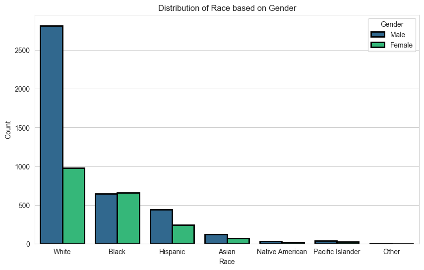
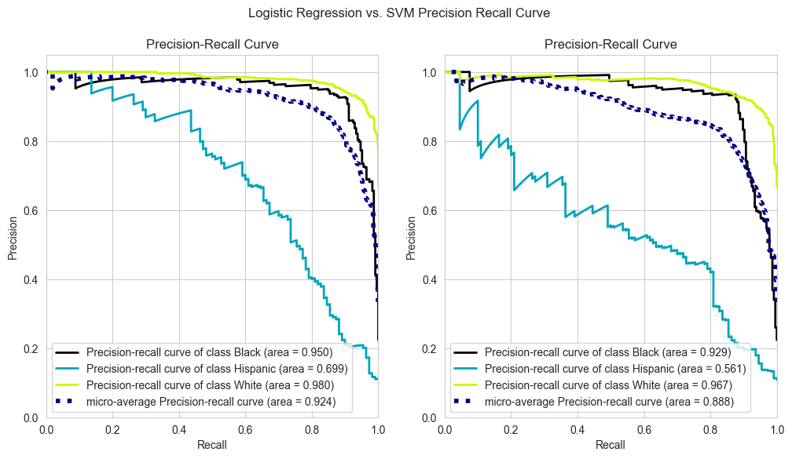

# Soldier Race Prediction

A machine learning project that utilizes supervised learning techniques for imbalanced multiclass classification. The goal of this project is to predict the race of a soldier based on a given set of features.

## Used Libraries 📚
- `numpy`- `pandas`- `matplotlib`- `seaborn`
- `sklearn`- `scikitplot` - `imblearn`- `shap`

## Run the project ⚙️

The repository includes a Jupyter notebook which you can run on your local machine or use Google Colab.
## Results 🪄

The tuned logistic regression model showed great scores and got good scores for the minority class outperforming 3 tuned models (SVM, Random Forest, XGBoost). The above image demonstrates the Recall-Precision Curve between the best two performing model and we can notice that the tuned logistic regression model is more consistent. 

Optimal Hyperparameters for Logistic Regression:

| Parameter    | Value   |
| :---: | :---: |
| C   | `1`   |
| class_weight   | `'balanced'` |
| max_iter   | `1000` |
| solver   | `'sag'` |
| random_state   | `2023` |

Comparing Hispanic Scores for SVM and Logistic Regression:

| Model |  F1_Hispanic  | Precision_Hispanic | Recall_Hispanic |
|:-----|:------:|:------:|------:|
| **Logistic Regression**	   | `0.560060` | `0.450515` | `0.745455` |
| **SVM**	    |  `0.512673`  |   `0.385620` | `0.772727` |

## Acknowledgements

This project is part of ML bootcamp provided by <a href="https://clarusway.com/"> Clarusway</a>.
